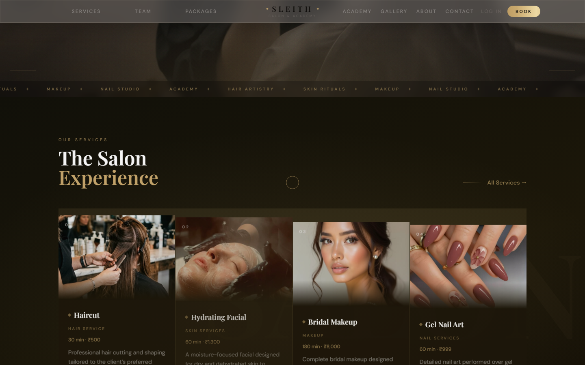
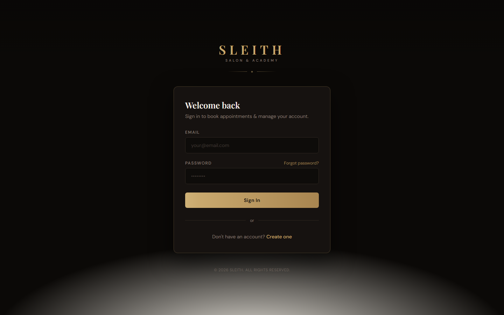
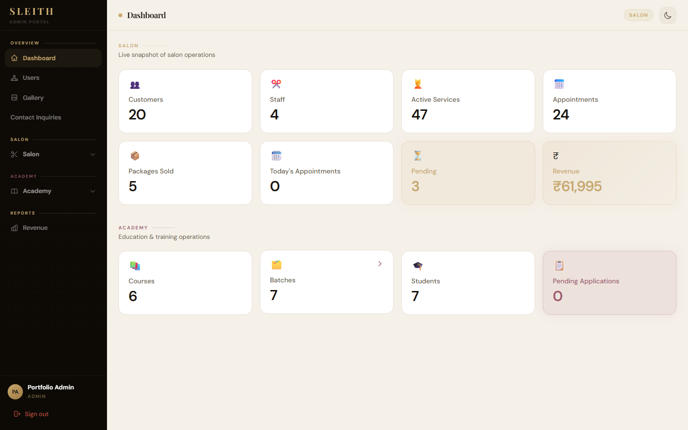
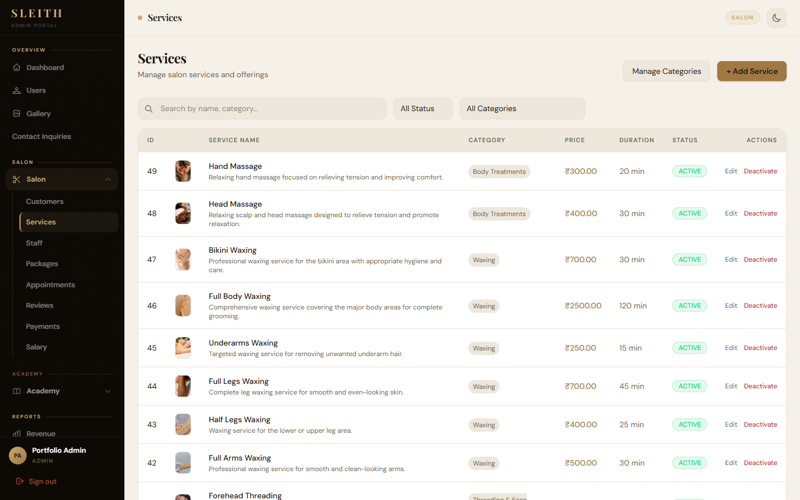
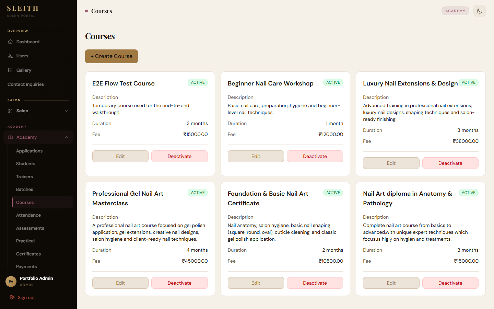
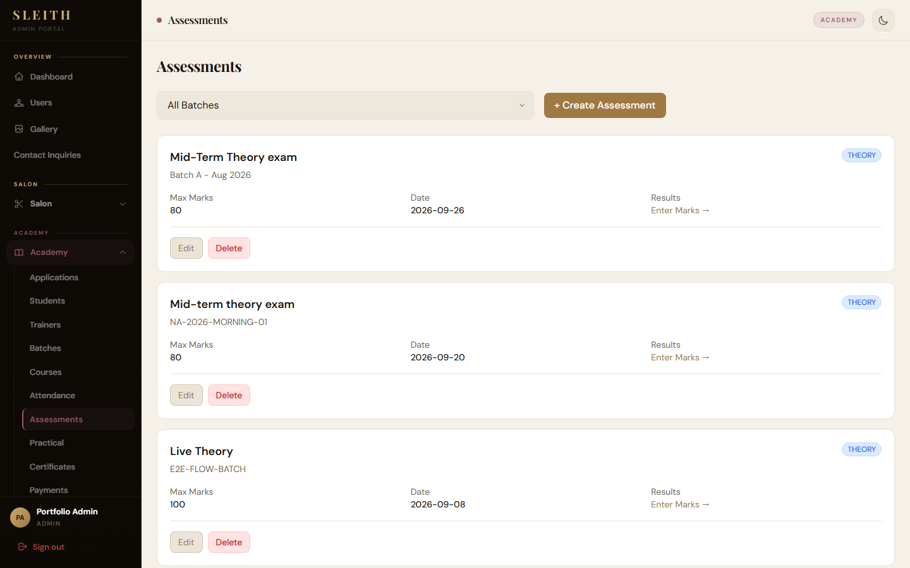

# SLEITH — Salon & Nail Academy

Luxury salon booking plus a nail academy in one product. Customers book services, buy packages, apply to courses, and pay on the site. Staff run the salon and academy from a separate admin portal.

The apps live in three folders on purpose. That is a normal full-stack setup, not a deploy blocker. This repo is the source. It is not a live production deploy.

<p align="center">
  
</p>

## Apps

| Folder | App | Local URL |
| --- | --- | --- |
| `backend/` | Django REST API, JWT, Razorpay, Twilio WhatsApp | http://localhost:8000 |
| `admin/` | React + Vite staff portal | http://localhost:5173 |
| `customer/` | React + Vite customer site | http://localhost:5174 |

## Screenshots

### Customer site

<p align="center">
  
</p>

<p align="center">
  
</p>

<p align="center">
  
</p>

### Admin portal

<p align="center">
  
</p>

<p align="center">
  
</p>

<p align="center">
  
</p>

<p align="center">
  
</p>

## What it does

**Salon**
- Service catalog, stylists, packages, and appointment booking
- Razorpay checkout for appointments, packages, and academy fees
- WhatsApp confirmation / cancel / reschedule / 24h reminder via Twilio
- Reviews, gallery, contact inquiries (admin replies by email)

**Academy**
- Course apply → approve + batch → fee → attendance
- Assessments and practicals, with marks locked until the exam date
- Certificates and student progress

**Auth & roles**
- JWT (SimpleJWT)
- Roles: Customer, Staff, Trainer, Manager, Admin

## Run locally

You need Python 3.13, Node 20+, and the three `.env` files below.

**1. Backend**

```bash
cd backend
python -m venv venv
venv\Scripts\activate
pip install -r requirements.txt
copy .env.example .env
python manage.py migrate
python manage.py runserver
```

**2. Admin**

```bash
cd admin
copy .env.example .env
npm install
npm run dev
```

**3. Customer**

```bash
cd customer
copy .env.example .env
npm install
npm run dev
```

Fill Razorpay, email, and Twilio keys in `backend/.env` only if you want those extras. The apps run without them; payments and WhatsApp will stay inactive.

## Deploy

Separate folders are fine to deploy. Typical split:

- `backend/` on Render, Railway, or a VPS
- `admin/` and `customer/` on Vercel or Netlify
- Point `VITE_API_BASE_URL` at the live API
- Set `CORS_ALLOWED_ORIGINS`, `CUSTOMER_FRONTEND_URL`, and `ADMIN_FRONTEND_URL` on the backend

This GitHub repo is the portfolio source. Production hosting is not set up here.

## Contributor

Muskan Nag — [github.com/Muskanlol](https://github.com/Muskanlol)

Built solo.
